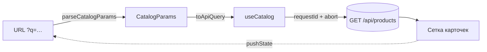

<div align="center">

# 🛍️ Product Catalog

Каталог из 500 товаров: поиск, фильтры, сортировка и пагинация работают вместе,<br>
а состояние выдачи живёт в URL — **ссылка открывает ровно то, что видел отправитель**.


[Запуск](#-запуск) · [Проверки](#-проверки) · [Состояние в URL](#-состояние-в-url) · [Решения](#-решения) · [Ответы на вопросы](#-ответы-на-вопросы)

</div>

---

## 🚀 Запуск

| Команда | Что поднимает |
| --- | --- |
| `docker compose up --build` | приложение → http://localhost:8080 (nginx)<br>mock API → http://localhost:4000 |
| `npm ci` → `npm run mock-api` + `npm run dev` | режим разработки → http://localhost:5173 |

> [!NOTE]
> Mock API из задания лежит в `mock-api/` без изменений. CSS Modules, без UI-кита.

## ✅ Проверки

| Команда | Что проверяет |
| --- | --- |
| `npm run lint` · `npm run typecheck` | ESLint · типы JSDoc |
| `npm test` | unit-тесты: `catalogParams`, пагинация, форматирование цены |
| `npm run test:e2e` | e2e на реальном mock API — серверы поднимаются сами |
| `npm run test:e2e:race` | 🏁 приёмочный тест гонки, 10 прогонов подряд |

> [!TIP]
> Перед первым e2e: `npx playwright install chromium`.

## 🔗 Состояние в URL



| Параметр | Правило |
| --- | --- |
| `q` | обрезка пробелов, пустой не пишется |
| `category` | id; сохраняется, пока грузится справочник, валидность проверяет API |
| `price_min` · `price_max` | число ≥ 0 |
| `in_stock` | только `true` |
| `sort` | `price_asc` · `price_desc` · `rating` |
| `page` | целое ≥ 1, `1` не пишется · `limit` — константа 24 |

Разбор и сериализация — [`src/lib/catalogParams.js`](src/lib/catalogParams.js): фиксированный
порядок полей, мусор из ссылки сбрасывается к значениям по умолчанию. Одинаковые по смыслу
ссылки дают один ключ запроса.

## 🧩 Решения

| Что | Как |
| --- | --- |
| **Источник состояния** | только URL: `pushState` при изменении, перечитывание на `popstate`; новое состояние строится от актуального URL |
| **Запись в историю** | только завершённые изменения и только если URL реально изменился |
| **Поиск** | через 300 мс после ввода или сразу по Enter |
| **Цена** | через 500 мс, по Enter или при уходе из поля; при `min > max` — ошибка у поля, URL и выдача не меняются |
| **Категория, наличие, сортировка** | сразу |
| **Страница** | сбрасывается на 1 при смене поиска/фильтров; номер вне диапазона заменяется последним через `replaceState` |
| **Пагинация** | заблокирована во время загрузки — нет двойного перехода; до 600 px — «Стр. N из M» |
| **Гонки запросов** | `requestId` + `AbortController` в `useCatalog`, см. [вопрос 1](#1-что-гарантирует-что-старый-ответ-не-перетрёт-новый) |
| **Библиотеки** | без UI-кита и React Query: сетка, фильтры и запросы написаны вручную, примитивы — `src/shared/ui` |

> [!IMPORTANT]
> **Отступление от плана:** цена подтверждается задержкой, а не кнопкой «Применить» — ради более простого интерфейса.

## 💬 Ответы на вопросы

### 1. Что гарантирует, что старый ответ не перетрёт новый?

- 🔢 Каждый запрос получает растущий `requestId`; ответ применяется, только если его id — последний.
- ✋ Предыдущий запрос отменяется через `AbortController`. Это экономит трафик, но **не гарантия**:
  ответ мог уже стоять в очереди браузера.

**Обратный порядок ответов:** новый ответ показывается сразу, старый приходит позже и
отбрасывается — его id устарел.

```text
запрос #4 «кроссовки» ───────────────────────── ответ ✗ id устарел, отброшен
запрос #5 «trail»     ───────── ответ ✓ показан
```

🧪 Проверка — [`e2e/search-race.spec.js`](e2e/search-race.spec.js): задержка 50–2000 мс,
5 запросов подряд, проверки после завершения или отмены *каждого* запроса.
Без защиты тест падает примерно в половине прогонов.

### 2. Что лежит в URL, а что нет? Как ведёт себя «Назад» при вводе в поиск?

| | В URL | Не в URL |
| --- | --- | --- |
| **Что** | `q`, фильтры, сортировка, страница — всё, что определяет набор и порядок товаров | недоприменённый текст поиска и цены, фокус, загрузка, справочник категорий, размер страницы |
| **Почему** | ссылка, reload, новая вкладка и «Назад»/«Вперёд» восстанавливают выдачу один в один | это состояние интерфейса: им незачем делиться, а запись каждого символа засорила бы историю |

**«Назад» при вводе:**
- ⏱️ запись в истории появляется только после паузы 300 мс или Enter — «Назад» ведёт
  к предыдущему *запросу*, а не к предыдущей букве;
- ↩️ если нажать «Назад» до срабатывания таймера, отложенный поиск отменяется, а поле
  и выдача восстанавливаются из URL.
